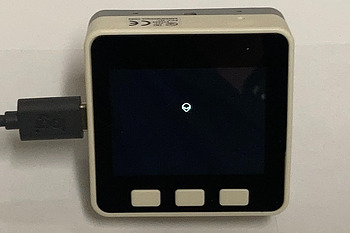

.. _alien:

alien.py
=========

    Bounce a bitmap of an alien around the display.

The alien_bitmap module was created using the :ref:`image_converter.py<image_converter>` utility.

.. literalinclude:: ../../../examples/alien/make_alien_bitmap.sh

.. note:: This example requires the following modules:

  .. hlist::
     :columns: 3

     - `st7789py`
     - `tft_config`
     - `alien_bitmap`

The alien.png PNG file is from the Erik Flowers Weather Icons available from
https://github.com/erikflowers/weather-icons and is licensed under SIL OFL 1.1
(http://scripts.sil.org/OFL).

.. literalinclude:: ../../../examples/alien/alien.py
   :language: python
   :linenos:
   :lines: 1-

