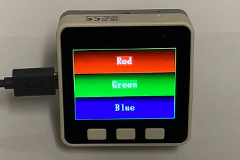

.. _color_test:

color_test.py
=============

    Test color with gradients.

Draws Red, Green and Blues gradients on the display and writes the color name centered in the
gradient.  Then repeatedly draws a borders around the display in the same colors.

.. note:: This example requires the following modules:

  .. hlist::
    :columns: 3

    - `st7789py`
    - `tft_config`
    - `vga2_bold_16x32`

.. literalinclude:: ../../../examples/color_test.py
   :language: python
   :linenos:
   :lines: 1-

