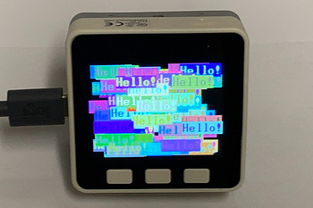

.. _hello:

hello.py
========

    Test for text_font_converter.

Writes "Hello!" in random colors at random locations on the Display.
https://www.youtube.com/watch?v=atBa0BYPAAc

.. note:: This example requires the following modules:

  .. hlist::
    :columns: 3

    - `st7789py`
    - `tft_config`
    - `vga2_bold_16x32`

.. literalinclude:: ../../../examples/hello.py
   :language: python
   :linenos:
   :lines: 1-

