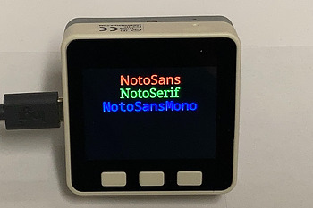

.. _noto_fonts:

noto_fonts.py
=============

    Test for TrueType write_font_converter.

Writes the names of three Noto fonts centered on the display using the font.
The fonts were converted from True Type fonts using the
:ref:`write_font_converter.py<write_font_converter>` utility.

.. note:: This example requires the following modules:

  .. hlist::
    :columns: 3

    - `st7789py`
    - `tft_config`
    - `NotoSans_32`
    - `NotoSerif_32`
    - `NotoSansMono_32`

.. literalinclude:: ../../../examples/noto_fonts/noto_fonts.py
   :language: python
   :linenos:
   :lines: 1-

