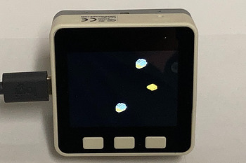

.. _tiny_toasters:

tiny_toasters.py
================

    Test sprites_converter.

Tiny Flying Toasters for smaller displays using a converted BMP spritesheet module using:

.. code-block:: console

  `sprites_converter.py ttoasters.bmp 32 32 4 > ttoast_bitmaps.py`

.. rubric:: The tiny_toasters.py example uses the spritesheet from CircuitPython_Flying_Toasters pendant
  project https://learn.adafruit.com/circuitpython-sprite-animation-pendant-mario-clouds-flying-toasters

.. note:: This example requires the following modules:

  .. hlist::
     :columns: 3

     - `st7789py`
     - `tft_config`
     - `tiny_toasters`

.. literalinclude:: ../../../examples/tiny_toasters/tiny_toasters.py
   :language: python
   :linenos:
   :lines: 1-

